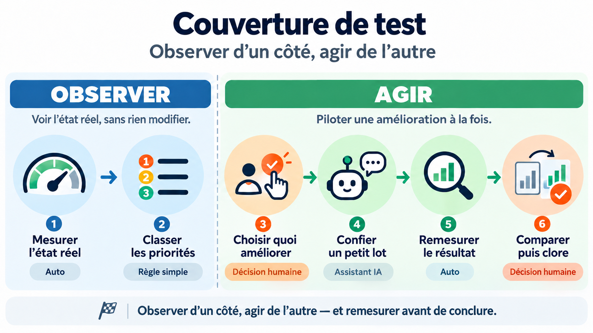
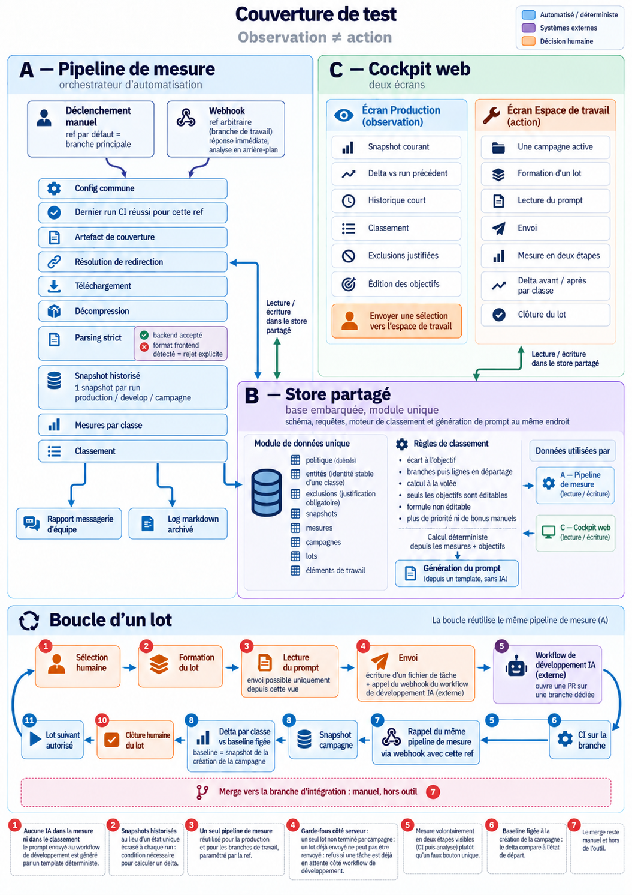
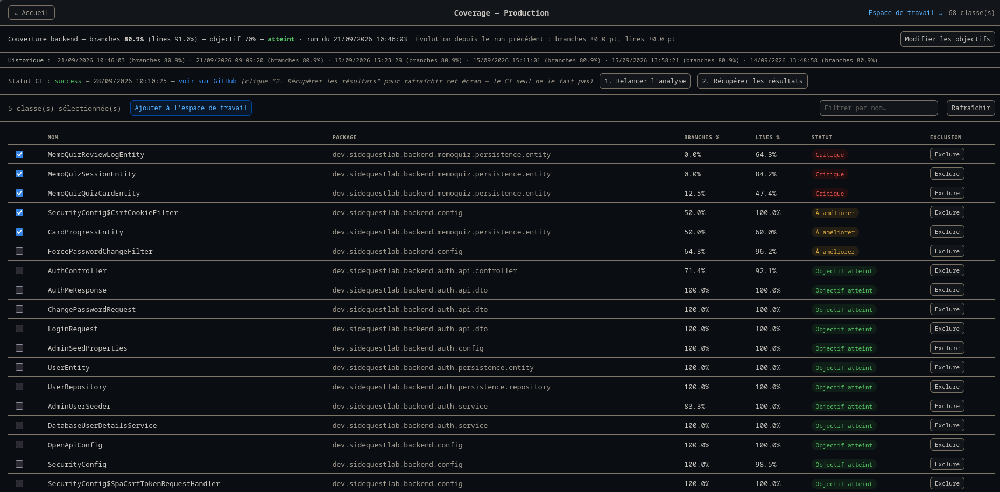
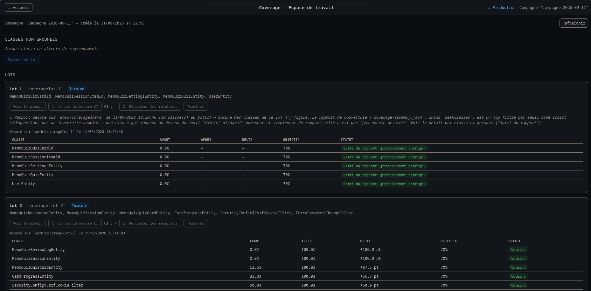

# Refondre un outil de couverture de tests : séparer observation et action

## En bref

J’ai construit un outil pour suivre la couverture des tests backend d’un projet personnel et m’aider à choisir où écrire de nouveaux tests. Il fonctionnait, mais il était devenu pénible à utiliser. À force d’ajouts, j’avais mélangé deux usages : voir l’état réel du projet et organiser le travail pour l’améliorer.

La refonte part de cette séparation. Une vue **Production** montre l’état du code livré et son évolution. Un **espace de travail** permet de préparer une campagne, d’avancer par lots et de comparer les résultats. J’ai aussi supprimé les réglages de priorité et de « bonus » que je ne savais plus interpréter clairement.

La mesure et le classement restent entièrement déterministes. Un workflow de développement assisté par IA intervient ensuite pour écrire des tests, mais il s’agit d’un système séparé. Pour l’instant, un seul lot réel a été envoyé, mesuré et comparé. Ce premier essai a surtout permis de trouver des bugs que mes données de test ne révélaient pas.

## Comment l’outil s’était compliqué

Au départ, il s’agissait surtout de traiter un rapport de couverture. J’ai ensuite ajouté des fonctions pour décider quoi améliorer : une priorité `low/medium/high` par classe, un « bonus » numérique libre, une exclusion, la sélection d’une classe, la génération d’un prompt et l’envoi au workflow de développement. En préparant la refonte, j’ai recensé onze responsabilités dans ce même outil.

Trois problèmes revenaient souvent :

- **Des réglages difficiles à interpréter.** Un bonus de 3, de 300 ou de 3 000 n’avait pas d’échelle définie. Une exclusion enregistrée comme un simple `true` ne disait plus pourquoi la classe avait été écartée.
- **Une unité de travail trop petite.** Sélectionner dix classes pouvait aboutir à dix Pull Requests. L’automatisation m’épargnait une partie du travail de développement, mais ajoutait du suivi et des manipulations.
- **Aucun historique pour comparer.** La mesure était écrasée à chaque exécution. Je voyais le pourcentage du moment, sans pouvoir suivre son évolution ni mesurer l’écart entre le point de départ et une branche de travail.

Le problème n’était donc pas seulement le nombre de fonctionnalités. L’outil utilisait les mêmes données pour deux activités qui n’ont pas le même rythme : observer une référence stable et mener un travail temporaire qui évolue à chaque lot.

## Séparer les usages, puis retirer des réglages

La vue **Production** sert de référence : elle présente la couverture du code livré, son historique et les classes les plus éloignées des objectifs. L’**espace de travail** sert à choisir les classes, constituer les lots et suivre leurs résultats. L’un montre un état ; l’autre accompagne une action.

Cette séparation m’a conduit à trois choix :

- **Garder la mesure déterministe.** Les taux de lignes et de branches viennent du rapport de couverture. Le classement est calculé à partir de ces données et des objectifs définis dans l’outil. Aucun modèle de langage ne décide quelle classe est prioritaire.
- **Remplacer les scores libres par une règle lisible.** Les priorités et les bonus manuels disparaissent. Le classement repose sur l’écart à l’objectif : d’abord les branches, puis les lignes pour départager. On peut régler les objectifs et le nombre de candidats proposés, mais pas modifier la formule au cas par cas.
- **Laisser les décisions à l’humain.** Le classement propose des candidats ; je choisis les classes à traiter, je constitue les lots et je décide quand les clore. Une exclusion reste possible, avec un motif obligatoire.

L’unité de travail devient le **lot** : un petit groupe de classes associé à une branche, une tâche envoyée au workflow de développement et une Pull Request. C’est plus proche de ce que je peux relire et suivre concrètement.

## Comment le workflow fonctionne

### Trois composants qui partagent les mêmes données

L’architecture tient en trois blocs :

- **Un pipeline de mesure**, orchestré par n8n, récupère le rapport de couverture produit par la CI pour une référence Git, enregistre un snapshot et calcule le classement. Il sert aussi bien pour la branche principale que pour la branche d’un lot.
- **Un store SQLite** conserve les objectifs, les exclusions, les snapshots, les mesures par classe, les campagnes et les lots. Un module commun regroupe le schéma, les requêtes, le classement et la génération du prompt ; le pipeline et le cockpit l’utilisent.
- **Un cockpit web** présente les vues Production et espace de travail. Il permet de préparer un lot, de l’envoyer au workflow de développement, de déclencher sa mesure et de voir le résultat.

La CI produit le rapport ; le pipeline le mesure ; le cockpit pilote le travail. Le workflow qui écrit les tests reçoit une tâche depuis le cockpit et fonctionne à côté de cet outil. Cette frontière compte : les résultats de couverture ne reposent pas sur ce que l’IA dit avoir fait, mais sur un rapport produit par la CI.

### Un pipeline de mesure paramétré par la référence Git

Deux déclencheurs alimentent le même pipeline : un lancement manuel, sur la branche principale par défaut, et un webhook qui reçoit une référence Git. Le webhook répond rapidement ; l’analyse se poursuit en arrière-plan. Le cockpit peut donc demander aussi bien un rafraîchissement de Production que la mesure de la branche d’un lot.

Le parcours est ensuite linéaire : retrouver le dernier run CI réussi pour cette référence, récupérer son artefact de couverture, suivre si nécessaire une redirection vers un stockage temporaire, décompresser et analyser le rapport. Un artefact expiré est signalé. Le parseur accepte uniquement le format backend attendu ; s’il reçoit un rapport frontend, il le rejette explicitement au lieu d’enregistrer un backend vide.

Chaque exécution crée un **snapshot historisé**, associé au contexte `production`, `develop` ou `campaign`, avec une mesure par classe. Garder ces états successifs rend possibles l’historique et les comparaisons qui manquaient auparavant.

### Un classement calculé, puis une sélection humaine

Pour chaque classe, l’outil calcule l’écart à l’objectif en branches, puis en lignes pour départager les résultats. Les classes exclues restent visibles, mais ne sont plus proposées comme candidates. L’interface affiche des statuts lisibles — « Objectif atteint », « À améliorer » ou « Critique » — plutôt qu’un score manuel dont la valeur serait difficile à interpréter.

La vue Production permet de consulter cette mesure de référence avant d’envoyer une sélection vers l’espace de travail. Le classement aide à repérer où regarder ; il ne décide pas du travail à lancer.

### La boucle d’un lot

1. Depuis Production, je sélectionne des classes et les envoie vers l’espace de travail. Si nécessaire, une campagne s’ouvre avec le snapshot Production du moment comme **baseline**.
2. Je constitue un lot et je lis le prompt généré. Il donne la couverture de départ des classes ciblées, demande de comprendre leurs comportements réels avant d’écrire des tests et précise le périmètre de la tâche.
3. L’envoi crée un fichier de tâche pour le workflow de développement. Celui-ci travaille sur une branche dédiée et ouvre une Pull Request.
4. La mesure de cette branche se fait en deux actions visibles : déclencher le job de couverture, puis, une fois le job terminé, appeler le pipeline de mesure avec la référence de la branche. Ces deux actions restent distinctes parce qu’il peut y avoir plusieurs minutes d’attente ou un échec entre les deux.
5. Le cockpit affiche les écarts de couverture par classe entre la baseline et la dernière mesure de la branche : objectif atteint, progression ou régression.
6. Je clôture le lot pour pouvoir passer au suivant. La relecture de la Pull Request et le merge vers la branche d’intégration restent manuels, en dehors de l’outil.

La baseline est figée à l’ouverture de la campagne. **Pour les lots suivants, le delta restera calculé par rapport à ce point de départ. Si la branche mesurée inclut des changements issus de lots précédents, leurs effets s’y mêleront : le delta ne prouvera donc pas l’effet isolé du dernier lot.**

<!-- VISUEL 4 — Capture de l’écran de gestion des lots. À insérer ici, après la séquence et la précision sur la baseline. Légende suggérée : « Un lot à la fois, de la sélection à la mesure de sa branche. » -->

## Ce que l’outil contrôle vraiment

J’ai distingué les règles appliquées par le serveur, les choix d’interface et les consignes envoyées au workflow de développement. Ils n’ont pas la même force.

**Le serveur du cockpit** impose notamment : un seul lot non terminé par campagne, aucun second envoi du même lot, aucun envoi si une tâche attend déjà côté workflow de développement, un motif pour chaque exclusion et une seule campagne ouverte à la fois. Ces règles valent aussi si l’on contourne l’interface.

**L’interface** propose l’envoi vers l’IA depuis la vue du prompt, pour que je puisse le lire avant de lancer le travail. Cela facilite la relecture, mais ne garantit pas à lui seul qu’elle ait eu lieu.

**Le prompt** demande de ne modifier que les tests des classes listées, de ne pas écrire de tests artificiels pour gonfler la couverture et de ne toucher au code de production qu’en cas de bug bloquant documenté. Ce sont des consignes, pas des vérifications effectuées par l’outil. Le workflow de développement dispose de ses propres contrôles déterministes ; la Pull Request doit toujours être relue.

Enfin, la mesure après coup est indépendante de ce que le workflow affirme avoir réalisé. Elle peut montrer que les taux ont changé. Elle ne peut pas dire, à elle seule, si les tests ajoutés vérifient les bons comportements.

## Ce que j’ai vérifié en conditions réelles

En septembre 2026, la refonte est encore en statut `draft` ; l’ancienne version reste active. J’ai fait passer un lot réel de la sélection jusqu’à la comparaison : envoi au workflow de développement, Pull Request créée, couverture déclenchée sur la branche, rapport récupéré et écarts affichés. J’ai vérifié que le job mesurait bien la branche demandée en comparant deux runs réels et en inspectant directement l’artefact.

Ce premier passage a révélé des problèmes invisibles dans les tests sur données fabriquées : un lot pouvait être envoyé deux fois, le statut CI disparaissait au rechargement de la page et le snapshot Production ne se rafraîchissait pas après un run CI. J’ai aussi découvert un écart de conventions avec le workflow voisin : celui-ci retire les `/` du nom demandé et préfixe la branche réelle par `work/`. Le cockpit cherchait donc à mesurer une branche qui n’existait pas.

Un autre problème venait du rapport lui-même. Le champ que je lisais n’était pas l’inventaire complet des classes, mais un classement déjà filtré par un seuil fixé côté CI. Une classe pouvait disparaître d’une mesure à l’autre sans rapport avec les objectifs de l’outil. Le rapport expose désormais l’inventaire complet et le pipeline le consomme. C’est le type d’écart qu’on ne découvre qu’en examinant les sorties réelles des systèmes voisins.

Il reste des parcours à valider : modifier les objectifs depuis l’interface et vérifier leur effet sur le classement, tester le cycle d’exclusion, puis clôturer un lot et effectuer le merge manuel. Je n’ai pas non plus de mesure de temps gagné. À ce stade, le gain observé est surtout la lisibilité du cycle et la possibilité de comparer des mesures par classe.

## Les limites actuelles

- **Le périmètre est backend.** Je ne pilote pas la couverture frontend : ce projet n’a pas aujourd’hui de tests frontend significatifs à suivre de cette façon.
- **Le classement raisonne en pourcentages.** Une classe de 10 lignes à 0 % et une classe de 1 000 lignes à 50 % n’ont pas le même poids, mais la formule n’en tient pas compte. Il faudrait disposer aussi de comptes absolus dans le rapport de la CI.
- **Le débit est volontairement séquentiel.** Un seul lot peut être ouvert à la fois. Sa clôture est une déclaration humaine : l’outil ne vérifie pas que la Pull Request a été relue ou mergée.
- **La couverture n’est qu’un indicateur.** Les écarts disent quelles lignes et branches ont été exécutées ; ils ne mesurent ni la pertinence des assertions ni la qualité des tests.

La partie la plus utile de cette refonte, pour moi, a été de rendre les responsabilités plus nettes. Une fois l’observation et l’action séparées, j’ai pu retirer des réglages qui brouillaient les décisions, choisir le lot comme unité de travail et conserver les mesures nécessaires pour comparer. Le premier cycle réel n’a pas validé tout l’outil, mais il a déjà montré où mes hypothèses sur les systèmes voisins étaient fausses.
