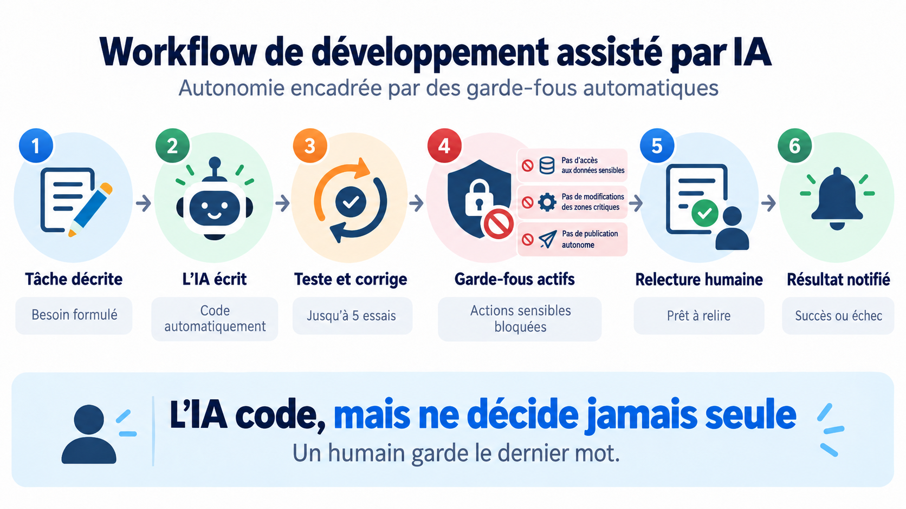
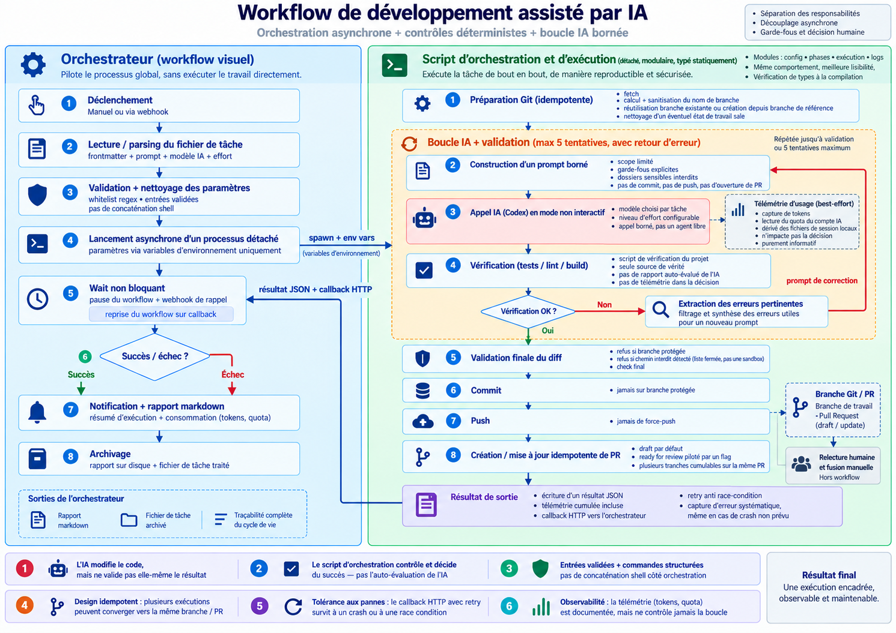
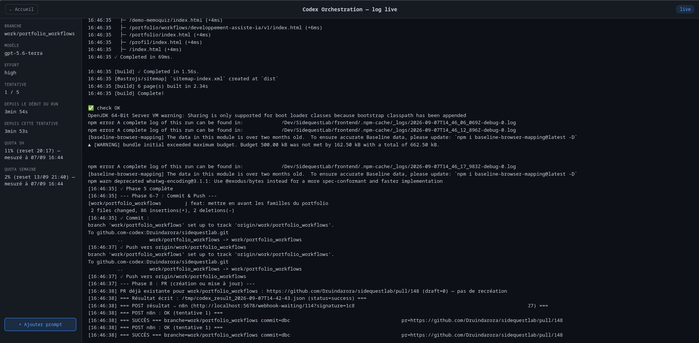

## En bref

Une petite tâche de développement — une fonctionnalité, un test, une correction — suit souvent le même cycle : créer une branche, écrire le code, lancer les vérifications, corriger si nécessaire, committer, pousser puis ouvrir une Pull Request.

Ce cycle est assez mécanique pour être automatisé avec une IA de codage. Le vrai problème n’est pas de lui déléguer l’écriture du code, mais de déterminer jusqu’où lui laisser la main.

Dans le workflow que j’ai construit, Codex écrit et corrige le code. En revanche, il ne décide jamais seul que son travail est acceptable, ne commit pas, ne pousse pas et ne crée pas lui-même de Pull Request.

Les contrôles et les opérations Git restent gérés par un script d’orchestration déterministe. La fusion, elle, reste entièrement humaine.

_Vue simplifiée : Codex produit le code, les contrôles déterministes valident le résultat, la fusion reste humaine._

L’objectif est donc de séparer trois responsabilités :

- **produire** une modification ;
- **vérifier** que certaines conditions objectives sont respectées ;
- **décider** si le code peut finalement être intégré.

Sur les exécutions archivées depuis mi-juin 2026, la grande majorité des tâches réelles ont abouti à du code vérifié, poussé et à une Pull Request ouverte ou mise à jour, prête pour une relecture humaine.

Le détail de ces résultats est présenté plus bas.

## Le problème concret

Donner à une IA de codage un accès direct au dépôt apporte beaucoup d’autonomie, mais crée aussi plusieurs risques.

Elle peut modifier des fichiers que je veux garder hors de son périmètre, par exemple la configuration d’infrastructure, la CI/CD ou du code d’API généré automatiquement.

Elle peut également considérer sa tâche comme terminée alors que les tests, le lint ou le build échouent encore.

Et si on lui donne également les commandes Git nécessaires, on peut aller jusqu’à la laisser committer, pousser ou ouvrir elle-même une Pull Request sur la base de sa propre évaluation.

Les zones interdites dans ce workflow ne viennent pas d’une liste générique de risques liés aux IA. Elles correspondent à des parties précises de mes projets que je veux garder hors de leur périmètre d’action.

L’objectif n’est donc pas de réduire au maximum l’autonomie de Codex. Il s’agit de lui donner suffisamment de liberté pour qu’il puisse réellement travailler, sans lui confier en même temps l’autorité de décider que son propre travail peut être accepté.

## L’approche : séparer production et validation

Le principe est simple : l’IA peut agir sur le code, mais elle ne décide pas seule si le résultat est acceptable.

Codex produit un diff dans le cadre de la tâche qui lui a été confiée.

Autour de lui, les opérations qui peuvent être déterministes le restent : validation des paramètres, préparation Git, exécution des vérifications du projet, contrôle des fichiers modifiés, commit, push et gestion de la Pull Request.

Concrètement, le workflow automatise :

- la préparation de la branche Git ;
- l’appel à Codex ;
- une éventuelle boucle de correction si les vérifications échouent ;
- le contrôle du diff réellement produit ;
- le commit et le push ;
- la création ou la mise à jour de la Pull Request ;
- la notification et l’archivage du résultat.

Deux décisions restent volontairement manuelles.

La première est la rédaction de la tâche elle-même, décrite dans un fichier texte avec un titre, un nom de branche et les changements demandés.

La seconde est la décision finale de fusionner la Pull Request. Cette étape reste entièrement en dehors du workflow.

## Comment le workflow fonctionne

### Vue d’ensemble

_Vue détaillée de l’orchestration entre n8n, le processus d’exécution et le dépôt Git._

Le système est séparé en deux parties : un orchestrateur n8n et un processus Node/TypeScript chargé de l’exécution.

**L’orchestrateur n8n** peut être déclenché manuellement ou par webhook. Il lit la tâche, valide les paramètres reçus, démarre l’exécution, attend son résultat, puis gère la notification et l’archivage.

**Le script d’exécution** réalise le travail effectif : préparation Git, appels à Codex, vérifications, contrôle du diff, commit, push et gestion de la Pull Request.

Ce script est lancé comme un processus détaché. Une tâche pouvant durer plusieurs minutes, cette séparation permet à l’orchestrateur de se mettre en attente pendant que le traitement continue indépendamment.

À la fin de l’exécution, le script renvoie son résultat à n8n par un appel HTTP qui réveille le workflow.

Une nouvelle tentative automatique est prévue si ce callback échoue la première fois. Cela couvre notamment le cas où le script terminerait suffisamment vite pour que l’orchestrateur n’ait pas encore atteint son nœud d’attente.

### Le script d’exécution

Le script était initialement un script shell unique. Il a depuis été réécrit en TypeScript et découpé par responsabilité : configuration, phases d’exécution, lancement de commandes et gestion des logs.

Le comportement général reste le même, mais cette organisation apporte notamment la vérification des types à la compilation et rend le code plus simple à faire évoluer.

Son fonctionnement peut être résumé en six grandes étapes.

### 1. Préparation Git

Le script récupère les dernières branches et construit un nom de branche de la forme `work/<sujet>` à partir du sujet de la tâche.

Le nom est nettoyé pour supprimer notamment accents, espaces et caractères spéciaux.

Il gère ensuite plusieurs situations :

- le dépôt est déjà positionné sur la bonne branche : rien à faire ;
- la branche existe déjà : elle est réutilisée ;
- elle n’existe pas : elle est créée depuis la branche de référence.

Un éventuel état de travail laissé par une exécution précédente peut également être nettoyé avant la création de la branche.

Cette logique est volontairement idempotente : plusieurs exécutions peuvent travailler successivement sur le même objectif sans échouer simplement parce que la branche existe déjà.

### 2. Boucle Codex + vérification

Codex est appelé une première fois avec la description de la tâche et les limites à respecter.

Le prompt lui indique notamment :

- les dossiers qu’il ne doit pas modifier ;
- qu’il ne doit pas créer de branche ;
- qu’il ne doit pas committer ;
- qu’il ne doit pas pousser ;
- qu’il ne doit pas ouvrir de Pull Request.

Le modèle utilisé et son niveau d’effort sont configurables par tâche et ne sont pas figés dans le script.

Après son travail, Codex peut produire un rapport sur ce qu’il estime avoir terminé. Ce rapport n’est toutefois jamais utilisé comme verdict.

La validation vient du script de vérification propre au dépôt cible : tests, lint et build selon la configuration du projet.

Si cette vérification échoue, les erreurs pertinentes — compilation, lint ou tests — sont extraites du résultat puis réinjectées dans une nouvelle demande de correction.

Le workflow autorise jusqu’à cinq tentatives.

### 3. Validation du diff

Une fois les vérifications passées, le workflow contrôle ce qui a réellement changé.

Il ne se base pas sur la liste de fichiers annoncée par Codex, mais sur l’état réel du dépôt obtenu avec Git.

Le script vérifie notamment :

- que la branche courante n’est pas une branche protégée ;
- qu’aucun fichier situé dans une zone interdite n’a été modifié sans autorisation explicite ;
- que l’état final du projet passe toujours les vérifications attendues.

Si un fichier interdit a été touché, l’exécution s’arrête avant tout commit.

### 4. Commit et push

Une fois ces contrôles passés, le script peut créer le commit et pousser la branche.

Ces opérations ne sont jamais réalisées sur une branche protégée et aucun `force push` n’est utilisé.

En mode test à blanc (`dry-run`), le commit et le push sont entièrement sautés.

### 5. Création ou mise à jour de la Pull Request

La gestion de la Pull Request est également idempotente.

Si aucune PR n’existe pour la branche, elle est créée.

Si une PR existe déjà parce qu’une exécution précédente travaillait sur le même sujet, le workflow ne crée pas de doublon. Le nouveau commit est simplement poussé sur la même branche et vient mettre à jour la Pull Request existante.

La PR reste en brouillon tant que la tâche n’est pas marquée comme la tranche finale.

Lors de la dernière tranche, elle peut passer en statut **Ready for review**. Cette action ne fusionne rien : la décision d’intégrer le code reste humaine.

### 6. Retour du résultat

À la fin de l’exécution, le résultat est systématiquement enregistré dans un fichier puis renvoyé à l’orchestrateur.

Il contient notamment :

- le statut de l’exécution ;
- la branche ;
- le commit éventuel ;
- la Pull Request ;
- les fichiers modifiés ;
- le nombre de tentatives effectuées.

Une capture d’exception englobe l’ensemble de l’exécution afin qu’un résultat puisse également être produit en cas d’erreur non prévue.

## Les garde-fous

C’est la partie la plus importante du workflow, mais tous les mécanismes n’offrent pas le même niveau de garantie.

Je distingue donc trois niveaux : **l’instruction donnée à l’IA**, **le contrôle indépendant par le code** et **la décision humaine**.

### Ce qui relève de l’instruction

Le prompt interdit explicitement à Codex de toucher certaines zones du projet : infrastructure, configuration CI et code d’API généré.

Il lui interdit également de créer une branche, de committer, de pousser ou d’ouvrir lui-même une Pull Request.

Ces instructions sont utiles : elles définissent clairement son périmètre de travail.

Je ne les considère cependant pas comme des garde-fous suffisants, puisqu’elles dépendent toujours du comportement du modèle.

### Ce qui relève du contrôle indépendant

Après chaque tentative, le premier contrôle est le script de vérification propre au dépôt.

C’est lui qui détermine si les tests, le lint et le build passent. Le rapport produit par Codex sur son propre travail n’a aucune autorité dans cette décision.

Une fois cette vérification passée, un second mécanisme analyse la liste réelle des fichiers modifiés à partir de Git et la compare à une liste de chemins interdits.

Si un fichier appartenant à l’une de ces zones a été modifié sans autorisation explicite, l’exécution est bloquée avant tout commit.

Ce garde-fou s’est réellement déclenché une fois sur les exécutions archivées. Il ne s’agit donc plus uniquement d’un cas prévu dans le code : il a effectivement empêché une modification hors périmètre d’aller jusqu’au commit.

Sa portée reste néanmoins limitée.

Le mécanisme repose sur une liste fermée de préfixes de chemins considérés comme sensibles. Il ne constitue pas une sandbox générale qui enfermerait Codex dans une liste exhaustive de fichiers autorisés.

Une zone sensible absente de cette liste ne serait pas protégée par ce contrôle.

De la même façon, ce mécanisme vérifie **quels fichiers ont changé**, pas la qualité du contenu de ces modifications.

### Redondance volontaire

Certains contrôles existent à plusieurs niveaux.

Le nom de branche et le chemin du dépôt sont par exemple validés et nettoyés une première fois par l’orchestrateur avant le lancement, puis une seconde fois par le script d’exécution.

Les paramètres transmis au processus détaché passent uniquement par des variables d’environnement.

Les commandes Git et GitHub exécutées par le script reçoivent ensuite leurs arguments sous forme de tableaux plutôt que par assemblage d’une chaîne de commande shell.

Cette propriété concerne uniquement le code d’orchestration.

Elle ne signifie pas que les commandes éventuellement exécutées par Codex à l’intérieur du dépôt sont soumises au même mécanisme. Elles restent hors du contrôle direct de cette partie du système.

### Ce qui reste humain

La Pull Request reste en brouillon pendant le travail.

Une fois la tâche terminée, elle peut être passée en **Ready for review**.

Mais le workflow ne fusionne jamais automatiquement la PR vers la branche de référence.

Cette décision reste entièrement humaine.

## Ce qui est observable aujourd’hui

Les chiffres suivants proviennent des journaux archivés par le workflow entre mi-juin et fin août 2026.

L’utilisation a été sporadique et non continue. Il s’agit donc d’un historique d’usage réel, pas d’une mesure contrôlée ni d’une promesse de performance.

**29 exécutions archivées**  
**25 exécutions réelles**  
**22 réussites**  
**8 Pull Requests distinctes**  
**Environ 4 à 13 minutes par exécution réelle observée**

Sur les 29 exécutions archivées, 4 étaient des tests à blanc et 25 correspondaient à des exécutions réelles.

Parmi ces 25 exécutions réelles :

- **22 ont réussi**, avec du code vérifié, poussé et une Pull Request ouverte ou mise à jour ;
- **3 ont échoué**.

Les trois échecs sont de nature différente :

- une exécution a été bloquée par le contrôle des fichiers interdits avant qu’un commit ne soit créé ;
- sur une tâche de test triviale, Codex n’a produit aucune modification, donc rien ne pouvait être committé ;
- une exécution a échoué immédiatement à cause d’un problème de configuration, avant même le premier appel à Codex.

Un autre résultat est intéressant : sur les **29 exécutions archivées, échecs compris, aucune n’a nécessité une deuxième tentative Codex**.

Lorsque la vérification est passée, elle est passée dès le premier essai.

La boucle de correction automatique prévue jusqu’à cinq tentatives existe donc bien dans le workflow, mais elle n’a encore jamais eu à résoudre un véritable échec de vérification en conditions réelles.

Les 22 exécutions réussies correspondent par ailleurs à seulement **8 Pull Requests distinctes**.

Plusieurs tâches ont donc bien été exécutées en plusieurs tranches sur le même sujet, en réutilisant la même branche et la même Pull Request au lieu d’en recréer une à chaque fois.

Sur cet historique, une exécution réelle a duré entre environ **4 et 13 minutes** de bout en bout.

Je n’ai en revanche pas mesuré le temps gagné par rapport à une exécution manuelle équivalente.

Pour pouvoir l’affirmer proprement, il faudrait chronométrer des tâches comparables réalisées avec et sans ce workflow, ce que je n’ai pas fait.

Le résultat mesurable à ce stade reste donc l’historique des exécutions et leur issue.

## Limites

### La boucle de correction n’a pas encore fait ses preuves en usage réel

C’est l’un des mécanismes intéressants du workflow : lorsqu’une vérification échoue, Codex peut recevoir les erreurs et tenter une correction.

Mais sur l’échantillon actuel, cela ne s’est jamais produit.

Une exécution a soit passé les vérifications dès la première tentative, soit échoué pour une autre raison.

La capacité réelle de cette boucle à récupérer une tâche qui échoue au premier essai reste donc à démontrer.

### Le contrôle des chemins interdits n’est pas une sandbox

Le garde-fou protège une liste précise de zones sensibles.

Tout emplacement qui ne figure pas dans cette liste n’est pas protégé par ce mécanisme.

Il réduit donc un risque identifié, mais ne confine pas entièrement Codex à un périmètre fermé.

### Les contrôles automatisés ne garantissent que ce qu’ils couvrent

Un `check.sh` vert signifie que les tests, le lint et le build définis pour le projet passent.

Cela ne garantit pas que tous les cas métier sont couverts, que l’implémentation est la meilleure possible, que le code est bien conçu ou que le choix architectural est pertinent.

C’est précisément pour cette raison que la relecture humaine de la Pull Request reste une étape distincte.

### La télémétrie de consommation est uniquement informative

Les données de consommation — tokens et quota du compte IA — sont lues au mieux depuis un fichier de session local de l’outil.

Elles peuvent donc être incomplètes ou obsolètes.

Elles servent à observer les exécutions, mais n’interviennent pas dans la décision de poursuivre ou d’arrêter une tâche.

### Le workflow est conçu pour mon environnement actuel

Les chemins, la configuration SSH et certaines variables d’environnement correspondent aujourd’hui à la machine et aux dépôts sur lesquels le workflow fonctionne.

Le système n’est pas packagé pour être installé tel quel dans un autre environnement.

### L’échantillon reste limité

25 exécutions réelles sur environ deux mois et demi permettent déjà d’observer le comportement du workflow sur de vrais cas.

Cela reste toutefois un volume trop faible pour en tirer des conclusions statistiques générales.

## Ce que j’en retiens

### Une instruction donnée au modèle n’est pas un garde-fou

Le prompt est utile pour définir clairement ce que Codex est censé faire ou ne pas faire.

Mais lorsqu’une règle est importante, je préfère qu’elle soit également vérifiée indépendamment sur le résultat réel.

Dans ce workflow, cette différence n’est plus seulement théorique : le contrôle des fichiers modifiés a déjà bloqué une exécution qui avait dépassé le périmètre prévu.

### Automatiser l’exécution ne veut pas dire automatiser l’autorité

Codex peut écrire et corriger le code.

Le workflow peut vérifier le résultat et décider si les conditions techniques sont réunies pour créer un commit et pousser la branche.

Mais la décision de fusionner le code reste humaine.

Cette séparation évite qu’un même acteur produise une modification et décide seul qu’elle peut être acceptée.

### Un mécanisme qui n’a jamais été exercé reste une hypothèse de conception

La boucle de correction automatique existe et son fonctionnement est prévu dans le code.

Mais jusqu’à présent, aucune exécution réelle n’a eu besoin d’un deuxième essai.

Je peux donc expliquer son fonctionnement et pourquoi je l’ai conçue ainsi, mais pas encore prétendre que son efficacité est démontrée par l’usage.
